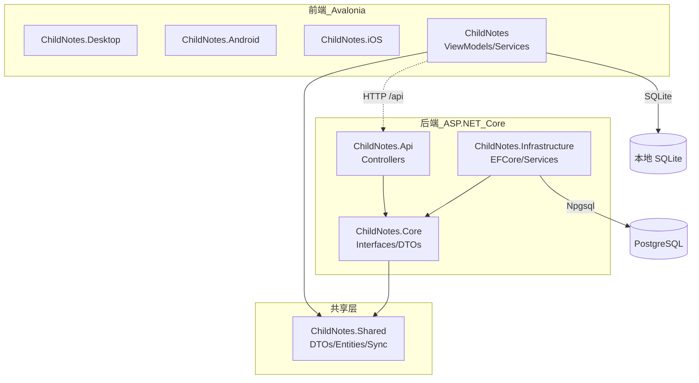

# ChildNotes 项目架构审视与改进分析报告

## 1. 执行摘要

ChildNotes 是一个跨平台育儿记录应用，采用 **Avalonia UI（前端）+ ASP.NET Core（后端）+ PostgreSQL/SQLite（数据库）** 的技术栈。项目当前处于 v0.x 阶段，整体架构已具备可运行的基础：前后端共享契约（`ChildNotes.Shared`）、Clean Architecture 分层（Api / Core / Infrastructure）、本地优先 + 后端同步的数据策略，以及针对疫苗时间轴等重点场景的专项性能优化。

本报告基于对 `E:\0_Code\5_Git\AiJi` 代码库的系统阅读（关键文件包括解决方案结构、csproj、Program.cs、DbContext、ViewModels、Services、API 控制器、CI/CD workflow 等），从 **10 个维度** 评估当前架构现状、识别风险，并提出 **可落地的改进建议**。核心发现如下：

| 维度 | 整体评价 | 最关键风险 |
|---|---|---|
| 模块划分 | 良好，前后端分层清晰 | 前端 `ServiceProvider` 手写的服务定位器导致测试性与生命周期管理不足 |
| 业务流程 | 完整，覆盖记录/统计/AI/同步 | 同步冲突解决策略过于简单（纯 LWW），多设备同时修改可能丢数据 |
| 数据流转 | 本地优先 + 增量同步 | 前后端时间序列/时区处理不一致，历史数据迁移策略缺失 |
| 接口规范 | 统一响应包装 | Controller 直接依赖 `JsonElement` 做反序列化，类型安全与验证薄弱 |
| 技术栈 | 选型合理，.NET 10 + Avalonia 12 | EF Core 9 + .NET 10 混用、NuGet 版本管理需收紧 |
| 扩展性 | 共享契约设计良好 | 前端缺少真正 IoC 容器，新平台接入成本高 |
| 性能 | 疫苗时间轴优化到位 | 同步批量加载缺少流式/分页 push、全局状态刷新缺少防抖 |
| 安全 | 后端 JWT + 限流 + 脱敏日志 | 前端密码明文存储、JWT Secret 本地回退机制、上传文件无类型校验 |
| 错误处理 | 全局异常中间件 + 前端兜底 | 业务错误码体系不统一，前端大量 `try/catch + DevLogger.Log` 隐藏异常 |
| 部署 | Docker + GitHub Actions 完整 | iOS 无法 CI、Android 本地无法编译、secrets 管理依赖文档 |

---

## 2. 项目概览

### 2.1 仓库结构

```
E:\0_Code\5_Git\AiJi
├── AiJi.slnx                    # 根解决方案入口
├── ChildNotes.Shared/           # 前后端共享契约（net10.0，无 UI/ORM 依赖）
├── ChildNotes/                  # Avalonia 前端
│   ├── ChildNotes/              # 共享库（ViewModels/Services/Controls）
│   ├── ChildNotes.Desktop/      # Windows 桌面入口
│   ├── ChildNotes.Android/      # Android 入口
│   ├── ChildNotes.iOS/          # iOS 入口
│   ├── ChildNotes.Tests/        # 前端测试
│   └── ChildNotes.UiDesignCheck/# UI 设计检查工具
├── ChildNotes.Backend/          # ASP.NET Core 后端
│   ├── ChildNotes.Api/          # Web API
│   ├── ChildNotes.Core/         # 领域/接口/DTO
│   ├── ChildNotes.Infrastructure/# EF Core / 服务实现
│   └── ChildNotes.Tests/        # 后端测试
├── .github/workflows/           # CI/CD
├── scripts/deploy/              # 部署脚本
└── Docs/                        # 设计文档
```

### 2.2 核心依赖关系



---

## 3. 维度 1：系统模块划分与边界定义

### 3.1 当前现状

**后端采用 Clean Architecture 三层划分：**

- `ChildNotes.Api`：Controllers、Filters、Middleware、Program.cs（[ChildNotes.Api/Program.cs](file:///E:/0_Code/5_Git/AiJi/ChildNotes.Backend/ChildNotes.Api/Program.cs)）
- `ChildNotes.Core`：实体接口、DTO、业务异常、服务契约（[ChildNotes.Core.csproj](file:///E:/0_Code/5_Git/AiJi/ChildNotes.Backend/ChildNotes.Core/ChildNotes.Core.csproj)）
- `ChildNotes.Infrastructure`：EF Core DbContext、服务实现、Auth、External Clients（[ChildNotes.Infrastructure.csproj](file:///E:/0_Code/5_Git/AiJi/ChildNotes.Backend/ChildNotes.Infrastructure/ChildNotes.Infrastructure.csproj)）

依赖方向正确：`Api -> Infrastructure -> Core -> Shared`，无循环依赖。

**前后端共享契约设计明确：**

- `ChildNotes.Shared` 仅包含 POCO/DTO/常量/协议，明确声明"不依赖任何 UI 或 ORM 框架"（[ChildNotes.Shared.csproj](file:///E:/0_Code/5_Git/AiJi/ChildNotes.Shared/ChildNotes.Shared.csproj)）
- 共享 DTO 如 [RecordDtos.cs](file:///E:/0_Code/5_Git/AiJi/ChildNotes.Shared/Dtos/RecordDtos.cs)、同步协议 [SyncProtocol.cs](file:///E:/0_Code/5_Git/AiJi/ChildNotes.Shared/Sync/SyncProtocol.cs)

**前端模块组织：**

- `Views/`、`ViewModels/`、`Services/`、`Data/Repositories/`、`Controls/`、`Models/` 分层清晰
- 但服务注册采用手写的 `ServiceProvider` 单例定位器（[ServiceProvider.cs](file:///E:/0_Code/5_Git/AiJi/ChildNotes/ChildNotes/Infrastructure/ServiceProvider.cs)），而非标准 DI 容器

### 3.2 不足与风险

1. **前端服务定位器模式**：`ServiceProvider.Instance` 是全局可变单例，所有 ViewModel 直接通过 `ServiceProvider.Instance.XxxService` 获取依赖。这导致：
   - 单元测试难以 mock 依赖
   - 服务生命周期不明确（所有服务都是单例）
   - 平台特定能力（如 Android 键盘服务）与共享服务耦合度不清

2. **前端 `Services` 与 `ViewModels` 边界模糊**：部分 ViewModel 直接调用 Repository（如 `VaccineFormViewModel` 通过 `RecordService` 间接使用 `RecordRepository`），但 `RecordService` 本身又持有 `AppState`，职责较重。

3. **`ChildNotes.Shared` 中"后端专用"类型污染共享契约**：[RecordDtos.cs](file:///E:/0_Code/5_Git/AiJi/ChildNotes.Shared/Dtos/RecordDtos.cs) 包含 `DailyRecordsResponse`、`DailyStatsResponse` 等标注为"后端专用"的类型，违反了共享层"前后端通用"的边界。

### 3.3 改进建议

#### 建议 1.1：前端引入标准 DI 容器替代 ServiceProvider

| 项目 | 内容 |
|---|---|
| **问题描述** | 当前 `ServiceProvider` 是手写单例定位器，ViewModel 直接依赖具体实现，难以测试和替换。 |
| **改进方案** | 引入 `Microsoft.Extensions.DependencyInjection`，在 `App.axaml.cs` 或 `Program.cs` 中构建 `IServiceProvider`：<br>1. 注册 Repository 为 Scoped/Singleton<br>2. 注册 Service 为 Singleton/Scoped<br>3. 使用 `ActivatorUtilities` 或构造函数注入创建 ViewModel<br>4. 保留 `ServiceProvider.Instance` 作为兼容 shim，逐步迁移 |
| **预期效果** | 提升可测试性；支持按平台替换服务实现；生命周期可控；与后端 DI 体验一致。 |
| **实施难度** | 中（需修改所有 ViewModel 构造函数与创建点） |
| **优先级** | **P1（高）** |

#### 建议 1.2：将后端专用 DTO 移出 Shared 项目

| 项目 | 内容 |
|---|---|
| **问题描述** | `DailyRecordsResponse`、`DailyStatsResponse` 等类型仅后端使用，放在 `ChildNotes.Shared` 会误导前端开发者并扩大共享层变更面。 |
| **改进方案** | 将 `DailyRecordsResponse`、`DailyStatsResponse` 移至 `ChildNotes.Core.Dtos` 命名空间；在 `ChildNotes.Shared` 中仅保留前后端真正共享的 DTO。 |
| **预期效果** | 共享契约更纯粹；前端编译单元不再包含无用类型；明确 Shared 变更边界。 |
| **实施难度** | 低 |
| **优先级** | **P2（中）** |

#### 建议 1.3：为 ViewModel 定义清晰的 Activator/Factory

| 项目 | 内容 |
|---|---|
| **问题描述** | `MainShellViewModel` 在构造函数中直接 new 所有子 ViewModel（[MainShellViewModel.cs:130-190](file:///E:/0_Code/5_Git/AiJi/ChildNotes/ChildNotes/ViewModels/MainShellViewModel.cs#L130-L190)），启动开销大且依赖硬编码。 |
| **改进方案** | 引入 ViewModel 工厂或懒加载（Lazy<T>）：<br>1. 用 `Func<TViewModel>` 工厂委托创建<br>2. 或使用 `Lazy<T>` 延迟初始化非当前 Tab 的 ViewModel |
| **预期效果** | 减少启动内存占用；支持按需创建；便于替换实现。 |
| **实施难度** | 中 |
| **优先级** | **P2（中）** |

---

## 4. 维度 2：核心业务流程设计

### 4.1 当前现状

**记录业务流程：**

- 前端通过 `RecordSheetViewModel` 统一打开各类记录表单
- `RecordService` 提供 `AddXxx` 方法，将 DTO 序列化到 `PayloadJson` 并写入 SQLite（[RecordService.cs](file:///E:/0_Code/5_Git/AiJi/ChildNotes/ChildNotes/Services/RecordService.cs)）
- 写入后通过 `SyncTrigger.NotifyWrite()` 触发后台同步

**登录与会话：**

- 本地注册/登录使用 SQLite 用户表（[AuthService.cs](file:///E:/0_Code/5_Git/AiJi/ChildNotes/ChildNotes/Services/AuthService.cs)）
- 会话持久化到 `user_session` 表，30 天滑动过期（[AuthService.cs:188-216](file:///E:/0_Code/5_Git/AiJi/ChildNotes/ChildNotes/Services/AuthService.cs#L188-L216)）
- 注册成功后 fire-and-forget 尝试远端注册（[AuthService.cs:83-117](file:///E:/0_Code/5_Git/AiJi/ChildNotes/ChildNotes/Services/AuthService.cs#L83-L117)）

**同步业务流程：**

- 本地优先，增量 Pull/Push（[ApiSyncService.cs](file:///E:/0_Code/5_Git/AiJi/ChildNotes/ChildNotes/Services/ApiSyncService.cs)）
- Pull 以 `last_sync_at` 为起点分页拉取（pageSize=500，maxPages=50）
- Push 将本地 `updated_at > since` 的数据上送，后端 LWW（Last-Write-Wins）合并
- 支持自动登录、token 失效重登、user_id 迁移修复

**AI 分析流程：**

- 本地 LLM 客户端（[LlmClient.cs](file:///E:/0_Code/5_Git/AiJi/ChildNotes/ChildNotes/Services/LlmClient.cs)）+ 后端 DeepSeek 客户端并存
- 7 天记录聚合后生成 prompt 调用大模型（[AiAnalysisService.cs](file:///E:/0_Code/5_Git/AiJi/ChildNotes/ChildNotes/Services/AiAnalysisService.cs)）

### 4.2 不足与风险

1. **同步冲突解决策略过于简单**：仅依赖 `UpdatedAt` 做 LWW。若两台设备离线修改同一条记录，后同步的设备会覆盖前者，**存在静默丢数据风险**。没有版本向量（vector clock）、操作转换（OT）或 CRDT 机制。

2. **用户 ID 迁移是历史包袱**：由于本地注册生成的 id 与后端不一致，代码中存在 `MigrateLocalUserIdIfNeeded`（[BaseApiClient.cs:134-153](file:///E:/0_Code/5_Git/AiJi/ChildNotes/ChildNotes/Services/BaseApiClient.cs#L134-L153)），这是设计债务，未来应避免。

3. **记录类型膨胀**：`RecordType` 包含 11 种类型，每种都有独立的 Add 方法，但 DTO 与实体之间缺少统一映射层，新增记录类型需要修改多处（Service、Controller、ViewModel、XAML）。

4. **远端注册失败无补偿**：`TryRegisterOnServerAsync` 是 fire-and-forget，失败后没有重试队列，用户可能在本地已注册但服务端没有账号，首次同步时需要再登录/注册。

### 4.3 改进建议

#### 建议 2.1：引入同步版本向量或向量时钟

| 项目 | 内容 |
|---|---|
| **问题描述** | 当前纯 LWW 同步无法处理多设备离线并发修改同一记录的冲突，会导致数据覆盖。 |
| **改进方案** | 1. 在 `ChildRecordBase` 增加 `Version`（long）或 `VectorClock`（JSON）字段<br>2. 后端 Push 时比较版本，若检测到并发冲突返回 `409 Conflict`<br>3. 前端根据策略自动合并（如字段级合并）或提示用户选择<br>4. 保留 LWW 作为默认降级策略 |
| **预期效果** | 避免静默数据丢失；支持多设备离线编辑；为家庭共享多人编辑打基础。 |
| **实施难度** | 高 |
| **优先级** | **P1（高）** |

#### 建议 2.2：统一记录类型注册与处理管道

| 项目 | 内容 |
|---|---|
| **问题描述** | 新增记录类型需要改 `RecordService` 11 个方法、`RecordController` switch、`RecordSheetViewModel` 表单映射，扩展成本高。 |
| **改进方案** | 引入 `IRecordHandler<TDto>` 或 `IRecordStrategy` 接口：<br>1. 每种记录类型一个 Handler<br>2. Handler 负责 DTO -> ChildRecord 映射、验证、聚合计算<br>3. `RecordService` 通过字典分发到 Handler |
| **预期效果** | 新增记录类型只需添加一个 Handler 和 ViewModel；核心流程无需改动。 |
| **实施难度** | 中 |
| **优先级** | **P2（中）** |

#### 建议 2.3：建立注册/登录的可靠补偿机制

| 项目 | 内容 |
|---|---|
| **问题描述** | `TryRegisterOnServerAsync` fire-and-forget，网络抖动时本地账号可能永远无法同步到后端。 |
| **改进方案** | 1. 在 `sync_log` 或新增 `pending_operations` 表中记录待执行的远端注册操作<br>2. 同步流程开始前检查未完成的注册操作并优先执行<br>3. 服务端注册接口保证幂等（按 username 唯一索引） |
| **预期效果** | 提高账号同步可靠性；避免首次同步 0 条数据的历史问题复发。 |
| **实施难度** | 中 |
| **优先级** | **P2（中）** |

---

## 5. 维度 3：数据流转机制

### 5.1 当前现状

**前端本地数据库：**

- SQLite，通过 `Microsoft.Data.Sqlite` 直接操作（[DbConnectionFactory.cs](file:///E:/0_Code/5_Git/AiJi/ChildNotes/ChildNotes/Data/DbConnectionFactory.cs)）
- 初始化使用手写 SQL（[DbInitializer.cs](file:///E:/0_Code/5_Git/AiJi/ChildNotes/ChildNotes/Data/DbInitializer.cs)）
- Schema 迁移策略：检测旧 schema 直接删除 DB 重建（[ServiceProvider.cs:128-196](file:///E:/0_Code/5_Git/AiJi/ChildNotes/ChildNotes/Infrastructure/ServiceProvider.cs#L128-L196)）

**后端数据库：**

- PostgreSQL + EF Core 9 + Npgsql（[ChildNotesDbContext.cs](file:///E:/0_Code/5_Git/AiJi/ChildNotes.Backend/ChildNotes.Infrastructure/Data/ChildNotesDbContext.cs)）
- 使用 `EnsureCreated()` 自动建表（[Program.cs:151-155](file:///E:/0_Code/5_Git/AiJi/ChildNotes.Backend/ChildNotes.Api/Program.cs#L151-L155)）
- 软删除通过 `HasQueryFilter` + `IgnoreQueryFilters` 实现

**共享实体：**

- `ChildRecordBase` 定义核心字段（[ChildRecordBase.cs](file:///E:/0_Code/5_Git/AiJi/ChildNotes.Shared/Entities/ChildRecordBase.cs)）
- 前端 `ChildRecord` 追加 `DeviceId`/`SyncedAt`/`GetPayload<T>`（[ChildNotes/Models/ChildRecord.cs](file:///E:/0_Code/5_Git/AiJi/ChildNotes/ChildNotes/Models/ChildRecord.cs)）
- 后端 `ChildRecord` 仅实现 `IAuditable`（[Backend/ChildRecord.cs](file:///E:/0_Code/5_Git/AiJi/ChildNotes.Backend/ChildNotes.Core/Entities/ChildRecord.cs)）

**时区处理：**

- 后端使用 UTC 存储（[SyncService.cs](file:///E:/0_Code/5_Git/AiJi/ChildNotes.Backend/ChildNotes.Infrastructure/Services/SyncService.cs) 中大量 `DateTime.SpecifyKind`）
- 前端使用本地 `DateTime`（未显式处理 Kind），同步时仅做简单转换

### 5.2 不足与风险

1. **前端数据库迁移策略粗暴**：通过检测 `child_record.id` 列类型是否为 INTEGER 来决定是否删除整个数据库（[ServiceProvider.cs:128-196](file:///E:/0_Code/5_Git/AiJi/ChildNotes/ChildNotes/Infrastructure/ServiceProvider.cs#L128-L196)）。正式上线后这种策略不可接受，会导致用户数据丢失。

2. **前后端时间语义不一致**：前端 `DateTime` 未明确 Kind，后端强制转 UTC。同步时可能出现：
   - 同一时刻前后端 `updated_at` 偏差
   - 夏令时/时区变更场景下 LWW 判断错误
   - `RecordDate` 是日期，但用 `DateTime` 存储，时区/Kind 混乱

3. **PayloadJson 反序列化无版本控制**：`ChildRecord.PayloadJson` 是 JSON 字符串，结构变更后没有版本号或迁移逻辑，历史数据可能反序列化失败。

4. **SQLite 与 PostgreSQL 数据类型映射差异**：例如 `decimal` 在前端 SQLite 是 REAL，后端 PostgreSQL 是 `decimal(5,2)`/`decimal(6,2)`，同步时可能产生精度问题。

5. **后端 `EnsureCreated()` 不适合生产**：首次部署自动建表，后续 schema 变更无法自动迁移，需要引入 EF Migrations。

### 5.3 改进建议

#### 建议 3.1：引入 EF Core Migrations 或替代迁移方案

| 项目 | 内容 |
|---|---|
| **问题描述** | 后端当前使用 `EnsureCreated()`，无法处理生产环境的 schema 演进。前端通过删除 DB 重建，正式上线不可接受。 |
| **改进方案** | **后端**：<br>1. 启用 EF Core Migrations：`Add-Migration InitialCreate`<br>2. 部署时执行 `dotnet ef database update` 或应用启动时自动应用（需权衡）<br>3. 移除 `EnsureCreated()`<br><br>**前端**：<br>1. 引入类似 FluentMigrator 或手写版本化迁移脚本<br>2. 维护 `schema_version` 表，按版本逐步执行 ALTER TABLE<br>3. 仅在极端不兼容时提示用户导出数据后重建 |
| **预期效果** | 生产数据安全；schema 变更有迹可循；前后端都有可靠迁移路径。 |
| **实施难度** | 中 |
| **优先级** | **P0（最高）** |
| **实施状态** | **已完成**（2026-07-07）。生成 `InitialCreate` 迁移文件到 `Data/Migrations/`，`Program.cs` 中 `EnsureCreated()` 替换为 `Migrate()`（InMemory 提供程序自动跳过）。新增 `ChildNotesDbContextFactory` 设计时工厂。详见 [Program.cs](file:///E:/0_Code/5_Git/AiJi/ChildNotes.Backend/ChildNotes.Api/Program.cs#L154)。 |


#### 建议 3.2：统一前后端时间模型

| 项目 | 内容 |
|---|---|
| **问题描述** | 前端使用未指定 Kind 的 `DateTime`，后端强制 UTC，同步时易出现偏差。 |
| **改进方案** | 1. 在 `ChildNotes.Shared` 中约定：所有跨网络传输的日期时间使用 `DateTimeOffset` 或明确 UTC 的 `DateTime`<br>2. 前端存储时统一转换为 UTC，展示时按本地时区转换<br>3. `RecordDate` 应使用 `DateOnly`（.NET 6+）或明确约定为 UTC Date<br>4. 同步协议 `SyncRecordItem` 中 `RecordDate`/`RecordTime`/`UpdatedAt` 全部使用 UTC |
| **预期效果** | 消除时区歧义；LWW 判断准确；跨时区使用（如出国）数据一致。 |
| **实施难度** | 中 |
| **优先级** | **P1（高）** |
| **实施状态** | **已完成**（2026-07-07）。采用"应用层统一 Local + 同步层边界转换"方案（非 DateTimeOffset 全量重构，见下方深度评估）。仓储读库时 `RecordTime`/`CreatedAt`/`UpdatedAt`/`SyncedAt` 统一 `ToLocalTime()`；`ApiSyncService` 新增 `ToLocal`/`ToUtc` 辅助方法在 Pull/Push 边界做转换；纯日期字段（`RecordDate`/`BirthDate`）保持 Unspecified。修复用户输入"16点"被显示成"08:00"的 bug。 |

##### 深度评估：统一时间模型可行性

**当前实际状态（经全量代码审查）：**

| 层面 | 时间处理方式 | 评估 |
|------|-------------|------|
| 后端存储 | PostgreSQL `timestamp with time zone`，审计拦截器自动设 `DateTime.UtcNow` | 正确 |
| 后端同步 | `SyncService` 通过 `DateTime.SpecifyKind(..., Utc)` 强制 UTC 清洗（约 20 处） | 防御性处理，有效 |
| 前端存储 | SQLite TEXT 格式，`created_at`/`updated_at` 通过 `AddUtc` 写入 ISO 8601 `"O"` 格式（带 `Z` 后缀），`record_date` 使用 `AddDate` 写入 `yyyy-MM-dd` | 日期字段分离，合理 |
| 前端读取 | `DateTimeExtensions.ParseDb` 使用 `DateTimeStyles.RoundtripKind` 保留 Kind | 正确 |
| 前端同步 | `ApiSyncService.Push` 直接传递本地 `DateTime`，未指定 Kind | 依赖后端清洗 |
| 共享协议 | `SyncRecordItem` 等全部使用 `DateTime`，无 `DateTimeOffset` | 类型一致 |
| `DateOnly` | 全局零使用 | 当前 `record_date` 用 `DateTime` + `AddDate` 已实现日期语义 |

**风险分析：**

1. **UTC+8 偏差风险**：前端 `RecordService` 使用 `DateTime.Now`（本地时间）创建记录，`RecordTime` 不做 UTC 转换直接传给 `ApiSyncService`，后端收到后 `SpecifyKind(..., Utc)` 会将本地时间错误标记为 UTC。但 `created_at`/`updated_at` 已通过 `AddUtc` 写为 UTC，`RecordDate` 通过 `AddDate` 写为纯日期，实际受影响的路径有限。
2. **LWW 判断偏差**：同步冲突使用 `UpdatedAt` 比较，而 `UpdatedAt` 在前端已通过 `AddUtc` 正确存储为 UTC，后端也使用 UTC，因此**当前 LWW 判断实际是正确的**。
3. **跨时区使用**：当前项目仅在中国大陆使用（UTC+8 固定），无跨时区需求。

**结论**：改为 `DateTimeOffset` 需修改所有共享实体基类（约 30+ 类型）、所有 DTO 和同步协议、前端约 50+ 处 `DateTime.Now` 引用、SQLite 存储格式、PostgreSQL 列类型映射和所有 UI 绑定。收益有限但代价巨大。原建议暂不实施。

**实际实施（2026-07-07）**：上述"小范围改动"在排查用户报告的"16点显示成08:00"bug 时被证伪——根因不是同步层，而是**应用层读库后未转 Local**。DB 存 `08:00Z`（UTC），UI 直接 `ToString("HH:mm")` 显示 UTC 时间，导致所有 `RecordTime` 显示偏移 8 小时（此前被"X 分钟前"差值计算 `Math.Max(0, ...)` 截断成"刚刚/0 分钟前"反向掩盖）。

最终采用**折中方案**：保留现有 `DateTime` 类型与 UTC 存储格式（不引入 `DateTimeOffset`），但在两个边界做显式转换：
- **仓储读库边界**（`RecordRepository`/`BabyRepository`/`MilestoneRepository`/`UserRepository` 的 `Map` 方法）：`RecordTime`/`CreatedAt`/`UpdatedAt`/`SyncedAt` 统一 `ToLocalTime()`，应用层始终持有 Local 时间；纯日期字段（`RecordDate`/`BirthDate`）保持 Unspecified。
- **同步出入边界**（`ApiSyncService`）：新增 `ToLocal`/`ToUtc` 辅助方法，`MapToRecord`（Pull）做 UTC→Local，`MapToRecordItem`（Push）做 Local→UTC，保证 DB 字典序比较仍基于 UTC 字符串（LWW 正确性不受影响）。

未做全量 `DateTimeOffset` 重构的原因与原结论一致：代价巨大、无跨时区需求。当前方案已彻底消除显示偏差与"X 分钟前"计算错误，是投入产出比最优的修复路径。


#### 建议 3.3：为 PayloadJson 引入版本化契约

| 项目 | 内容 |
|---|---|
| **问题描述** | `PayloadJson` 是动态 JSON，字段变更后旧数据反序列化可能失败。 |
| **改进方案** | 1. 在 DTO 基类 `BaseRecordDto` 中增加 `int Version { get; set; } = 1`<br>2. 序列化时写入版本号<br>3. 读取时根据版本号选择反序列化策略或做字段映射迁移<br>4. 为历史版本保留迁移测试 |
| **预期效果** | 支持记录结构演进；历史数据兼容；降低未来字段变更风险。 |
| **实施难度** | 中 |
| **优先级** | **P2（中）** |

---

## 6. 维度 4：接口设计规范

### 6.1 当前现状

**后端 API 响应格式：**

- 统一包装为 `{ state, msg, data, code? }`（[ApiResponse.cs](file:///E:/0_Code/5_Git/AiJi/ChildNotes.Backend/ChildNotes.Core/Common/ApiResponse.cs)）
- 通过 `ApiResponseWrapperFilter` 自动包装（[ApiResponseWrapperFilter.cs](file:///E:/0_Code/5_Git/AiJi/ChildNotes.Backend/ChildNotes.Api/Filters/ApiResponseWrapperFilter.cs)）

**Controller 设计：**

- `RecordController` 使用 `JsonElement payload` 手动反序列化 DTO（[RecordController.cs:30-62](file:///E:/0_Code/5_Git/AiJi/ChildNotes.Backend/ChildNotes.Api/Controllers/RecordController.cs#L30-L62)）
- `SyncController` 直接返回共享 DTO（[SyncController.cs](file:///E:/0_Code/5_Git/AiJi/ChildNotes.Backend/ChildNotes.Api/Controllers/SyncController.cs)）
- 认证使用 JWT Bearer（[Program.cs:61-74](file:///E:/0_Code/5_Git/AiJi/ChildNotes.Backend/ChildNotes.Api/Program.cs#L61-L74)）

**前端 API 客户端：**

- `BaseApiClient` 提供 `SendAsync`、`SendWithTokenAsync`、信封解析（[BaseApiClient.cs](file:///E:/0_Code/5_Git/AiJi/ChildNotes/ChildNotes/Services/BaseApiClient.cs)）
- V2 版本抛 `SyncException` 支持重试分类（[BaseApiClient.cs:220-270](file:///E:/0_Code/5_Git/AiJi/ChildNotes/ChildNotes/Services/BaseApiClient.cs#L220-L270)）

### 6.2 不足与风险

1. **`RecordController` 类型安全差**：使用 `JsonElement` 手动 switch 反序列化，运行时才发现 DTO 不匹配；无法利用 ASP.NET Core 模型验证；错误响应不一致。

2. **API 版本控制缺失**：所有路由都是 `/api/...`，没有版本前缀。未来破坏性变更（如建议 3.2 的时间模型改动）会强制所有客户端同时升级。

3. **分页参数缺少标准化**：`SyncController.Pull` 的 `since`/`limit` 是查询参数，但没有 `offset`/`cursor` 规范；`RecordController.History` 的 `limit=30` 是硬编码默认值。

4. **前端 `BaseApiClient` 职责过重**：同时承担通用 API 调用、自动登录、user_id 迁移、错误处理。`SendAsync` 返回 `null` 与 V2 抛异常两种模式并存，调用方容易混淆。

5. **CORS 配置过于宽松**：`AllowAnyOrigin().AllowAnyMethod().AllowAnyHeader()`（[Program.cs:144-145](file:///E:/0_Code/5_Git/AiJi/ChildNotes.Backend/ChildNotes.Api/Program.cs#L144-L145)），生产环境存在安全风险。

### 6.3 改进建议

#### 建议 4.1：为 RecordController 引入强类型 DTO 与统一验证

| 项目 | 内容 |
|---|---|
| **问题描述** | `RecordController.AddRecord` 使用 `JsonElement` 手动反序列化，失去编译期类型安全与模型验证。 |
| **改进方案** | 1. 定义 `RecordRequest<T>` 泛型包装或 `IRecordRequest` 接口<br>2. 使用强类型参数 `[FromBody] FeedRecordDto dto` 替代 `JsonElement`<br>3. 用 `Type discriminator`（`RecordType`）路由到不同 Action：<br>   `[HttpPost("feed")]`、`[HttpPost("sleep")]` 等<br>4. 或保留单一 endpoint 但使用 `JsonConverter` / `JsonPolymorphic` 做类型分发 |
| **预期效果** | 编译期类型检查；自动模型验证；Swagger 文档准确；错误响应统一。 |
| **实施难度** | 中 |
| **优先级** | **P1（高）** |

#### 建议 4.2：引入 API 版本控制

| 项目 | 内容 |
|---|---|
| **问题描述** | 无 API 版本机制，未来破坏性变更难以平滑演进。 |
| **改进方案** | 1. 采用 URL 路径版本：`/api/v1/records`、`/api/v2/records`<br>2. 或使用 `Asp.Versioning.Http` 包<br>3. 当前接口标记为 v1，新同步协议/时间模型放 v2 |
| **预期效果** | 支持多版本客户端并存；平滑升级；便于废弃旧接口。 |
| **实施难度** | 低 |
| **优先级** | **P2（中）** |

#### 建议 4.3：收紧 CORS 配置

| 项目 | 内容 |
|---|---|
| **问题描述** | 当前 CORS 允许任意来源，生产环境存在 CSRF/信息泄露风险。 |
| **改进方案** | 1. 生产环境只允许特定域名/子域名<br>2. 通过配置 `Cors:AllowedOrigins` 注入<br>3. 开发环境保留宽松策略 |
| **预期效果** | 降低跨域攻击面；符合安全最佳实践。 |
| **实施难度** | 低 |
| **优先级** | **P2（中）** |

#### 建议 4.4：统一 BaseApiClient 错误处理模式

| 项目 | 内容 |
|---|---|
| **问题描述** | `BaseApiClient` 同时存在返回 null 的旧模式与抛 SyncException 的 V2 模式，调用方语义不一致。 |
| **改进方案** | 1. 全部迁移到 V2 模式（抛 `SyncException`）<br>2. 为业务错误增加 `ErrorCode` 枚举<br>3. 在 `ApiSyncService` 等上层统一捕获并转换为用户消息 |
| **预期效果** | 错误处理一致性；便于 UI 根据错误类型展示不同提示。 |
| **实施难度** | 中 |
| **优先级** | **P2（中）** |

---

## 7. 维度 5：技术栈选型合理性

### 7.1 当前现状

- **.NET 10**：前后端统一使用 net10.0（[global.json](file:///E:/0_Code/5_Git/AiJi/global.json)、各 csproj）
- **Avalonia 12.0.5**：跨平台 UI 框架（[Directory.Packages.props](file:///E:/0_Code/5_Git/AiJi/ChildNotes/Directory.Packages.props)）
- **Semi.Avalonia 12.0.3**：主题库
- **EF Core 9.0.0**：后端 ORM（[ChildNotes.Infrastructure.csproj](file:///E:/0_Code/5_Git/AiJi/ChildNotes.Backend/ChildNotes.Infrastructure/ChildNotes.Infrastructure.csproj)）
- **PostgreSQL 16**：后端主数据库
- **SQLite**：前端本地数据库
- **Serilog + Async File Sink**：Release 日志（[ReleaseLogger.cs](file:///E:/0_Code/5_Git/AiJi/ChildNotes/ChildNotes/Infrastructure/ReleaseLogger.cs)）
- **CommunityToolkit.Mvvm 8.4.0**：MVVM 工具包
- **Keincheck 0.9.1**：仅 Desktop 项目 DEBUG 模式使用（[ChildNotes.Desktop.csproj](file:///E:/0_Code/5_Git/AiJi/ChildNotes/ChildNotes.Desktop/ChildNotes.Desktop.csproj)）

### 7.2 不足与风险

1. **EF Core 9 与 .NET 10 不匹配**：后端使用 .NET 10 但 EF Core 9，虽然当前可用，但未来 .NET 10 的 LTS 配套是 EF Core 10，可能存在兼容性或功能缺失风险。

2. **NuGet 版本管理不一致**：
   - 后端 csproj 显式指定版本（`Version="10.0.0"`），前端使用 Central Package Management（CPM）
   - `Swashbuckle.AspNetCore` 6.5.0 较旧，且与 .NET 10 的 OpenAPI 支持有重叠
   - `System.IdentityModel.Tokens.Jwt` 8.0.1 与 `Microsoft.AspNetCore.Authentication.JwtBearer` 10.0.0 的兼容性需确认

3. **Avalonia 12.0.5 主题版本差异**：Avalonia 12.0.5 但 Semi.Avalonia 12.0.3，主题包 patch 版本落后，可能存在样式不一致。

4. **SQLitePCLRaw 安全警告**：项目规则已提及存在 NU1903 高危漏洞警告，暂未升级。

5. **前端未使用 MVU/响应式框架的潜力**：大量手动 `INotifyPropertyChanged` 代码（如 `VaccinePlanView` 中 7 个 bool 属性手动通知），虽然已优化，但维护成本高。

### 7.3 改进建议

#### 建议 5.1：统一 NuGet 版本管理并升级到 EF Core 10

| 项目 | 内容 |
|---|---|
| **问题描述** | 后端版本未纳入 CPM；EF Core 9 与 .NET 10 目标框架不完全匹配。 |
| **改进方案** | 1. 将后端包版本也纳入根目录 `Directory.Packages.props`<br>2. 评估升级到 EF Core 10（随 .NET 10 发布）<br>3. 升级 `Swashbuckle` 或迁移到 .NET 10 内置的 OpenAPI |
| **预期效果** | 版本一致性；减少依赖冲突；获得最新性能与安全修复。 |
| **实施难度** | 中 |
| **优先级** | **P1（高）** |

#### 建议 5.2：升级 SQLitePCLRaw 并处理安全漏洞

| 项目 | 内容 |
|---|---|
| **问题描述** | `SQLitePCLRaw.lib.e_sqlite3` 存在 NU1903 高危漏洞警告。 |
| **改进方案** | 1. 升级到最新稳定版 `SQLitePCLRaw.bundle_e_sqlite3`<br>2. 若无法升级，在 CI 中显式审计并记录风险<br>3. 考虑切换到 `SQLitePCLRaw.bundle_green` 或系统 SQLite |
| **预期效果** | 消除安全警告；降低供应链攻击风险。 |
| **实施难度** | 低 |
| **优先级** | **P1（高）** |

#### 建议 5.3：对齐 Avalonia 与 Semi.Avalonia 版本

| 项目 | 内容 |
|---|---|
| **问题描述** | Avalonia 12.0.5 与 Semi.Avalonia 12.0.3 patch 版本不一致。 |
| **改进方案** | 1. 升级 Semi.Avalonia 到 12.0.5（如可用）<br>2. 在 CI 中增加版本兼容性检查 |
| **预期效果** | 避免主题 bug；确保样式行为一致。 |
| **实施难度** | 低 |
| **优先级** | **P3（低）** |

#### 建议 5.4：评估 Source Generators 减少 MVVM 样板代码

| 项目 | 内容 |
|---|---|
| **问题描述** | `VaccinePlanView` 等类中大量手动属性变更通知代码，维护成本高。 |
| **改进方案** | 1. 已使用 `CommunityToolkit.Mvvm`，但部分旧类未迁移<br>2. 逐步用 `[ObservableProperty]` 替代手动 INPC<br>3. 对性能极敏感场景保留手动控制 |
| **预期效果** | 减少样板代码；降低人为遗漏通知的风险。 |
| **实施难度** | 低 |
| **优先级** | **P3（低）** |

---

## 8. 维度 6：扩展性与可维护性设计

### 8.1 当前现状

**优势：**

- 前后端共享契约使 DTO/实体变更可同步
- `ChildNotes.Shared` 不依赖 UI/ORM，可被未来其他客户端复用
- 后端 `IBabyAccessService` 抽象了权限校验逻辑，消除多处重复
- `MainShellViewModel` 的弹层注册表机制（[MainShellViewModel.cs:75-128](file:///E:/0_Code/5_Git/AiJi/ChildNotes/ChildNotes/ViewModels/MainShellViewModel.cs#L75-L128)）使系统返回键处理可扩展

**可维护性债务：**

- 前端 `ViewModels/Forms/` 下 12 个表单 ViewModel，但缺少统一表单框架
- `App.axaml.cs` 中导航逻辑与生命周期管理混合（[App.axaml.cs:32-94](file:///E:/0_Code/5_Git/AiJi/ChildNotes/ChildNotes/App.axaml.cs#L32-L94)）
- 后端服务实现中存在大量 DTO 映射代码（如 [SyncService.cs:167-295](file:///E:/0_Code/5_Git/AiJi/ChildNotes.Backend/ChildNotes.Infrastructure/Services/SyncService.cs#L167-L295)），无 AutoMapper/Mapperly

### 8.2 不足与风险

1. **缺少对象映射器**：`SyncService`、`ApiSyncService` 中手写 To/From 映射，新增字段容易遗漏，且代码冗长。

2. **前端导航框架缺失**：`App.axaml.cs` 直接操作 `MainWindow.Content` 和 `RootContainer.SetContent`，页面间参数传递依赖事件订阅，不适合复杂导航。

3. **配置管理分散**：后端 `appsettings.json` + 环境变量，前端 `SyncConfigRepository` + `DeveloperPreferences` + `llm_config` 表，配置源不统一。

4. **测试覆盖不足**：前端测试仅有 5 个类（[ChildNotes.Tests](file:///E:/0_Code/5_Git/AiJi/ChildNotes/ChildNotes.Tests)），缺少 ViewModel 集成测试；后端测试主要是流程测试。

### 8.3 改进建议

#### 建议 6.1：引入 Mapperly 或 AutoMapper

| 项目 | 内容 |
|---|---|
| **问题描述** | 同步服务中手写实体/DTO 映射代码冗长且易遗漏字段。 |
| **改进方案** | 1. 引入 `Riok.Mapperly`（AOT 友好）<br>2. 为 `SyncBabyItem/Baby`、`SyncRecordItem/ChildRecord` 等定义 Mapper<br>3. 单元测试验证映射完整性 |
| **预期效果** | 减少样板代码；降低字段遗漏风险；映射逻辑可测试。 |
| **实施难度** | 低 |
| **优先级** | **P2（中）** |

#### 建议 6.2：引入轻量级导航框架

| 项目 | 内容 |
|---|---|
| **问题描述** | 当前导航逻辑分散在 `App.axaml.cs` 和 `MainShellViewModel`，页面参数传递依赖事件。 |
| **改进方案** | 1. 引入 Avalonia 导航框架（如 `AvaloniaInside.Navigation` 或自研）<br>2. 定义 `INavigationService` 接口<br>3. 将页面切换、参数传递、返回栈管理统一抽象 |
| **预期效果** | 页面导航可测试；支持深链接；便于未来扩展更多页面。 |
| **实施难度** | 高 |
| **优先级** | **P3（低）** |

#### 建议 6.3：统一配置管理

| 项目 | 内容 |
|---|---|
| **问题描述** | 前端配置分散在多个 Repository/表，后端用 appsettings，难维护。 |
| **改进方案** | 1. 前端引入 `IConfiguration` + `IOptions<T>` 绑定 SQLite 配置表<br>2. 定义 `AppSettings`、`LlmSettings`、`SyncSettings` 等强类型配置类<br>3. 后端保持现有 Options 模式 |
| **预期效果** | 配置访问统一；支持变更通知；便于按环境覆盖。 |
| **实施难度** | 中 |
| **优先级** | **P2（中）** |

#### 建议 6.4：增加 ViewModel 与同步服务单元测试

| 项目 | 内容 |
|---|---|
| **问题描述** | 前端缺少 ViewModel 测试，同步逻辑测试覆盖不足。 |
| **改进方案** | 1. 引入 DI 后，用 mock Repository 测试 ViewModel<br>2. 为 `VaccineTimelineBuilder`、`ApiSyncService` 增加边界测试<br>3. 增加多设备同步冲突场景测试 |
| **预期效果** | 降低回归风险；支撑重构；验证同步正确性。 |
| **实施难度** | 中 |
| **优先级** | **P1（高）** |

---

## 9. 维度 7：性能优化策略

### 9.1 当前现状

**疫苗时间轴专项优化（显著）：**

- 预加载缓存：`VaccineFormViewModel.PreloadAsync`（[VaccineFormViewModel.cs:61-92](file:///E:/0_Code/5_Git/AiJi/ChildNotes/ChildNotes/ViewModels/Forms/VaccineFormViewModel.cs#L61-L92)）
- 渐进式渲染：先显示前 4 个 group，剩余在下一帧追加（[VaccineFormViewModel.cs:140-164](file:///E:/0_Code/5_Git/AiJi/ChildNotes/ChildNotes/ViewModels/Forms/VaccineFormViewModel.cs#L140-L164)）
- OneTime 绑定与预计算 bool 属性（[VaccineCatalog.cs:402-449](file:///E:/0_Code/5_Git/AiJi/ChildNotes/ChildNotes/Services/VaccineCatalog.cs#L402-L449)）
- `IReadOnlyList` 替代 `ObservableCollection` 减少通知
- 原地更新避免全量重建（`UpdateForDone`/`UpdateForSkipped`/`UpdateForCancel`）

**同步性能：**

- Pull 分页（pageSize=500，maxPages=50）
- 单次事务提交所有 upsert
- 同步前 DB 备份

**日志性能：**

- ReleaseLogger 使用 Serilog Async Sink + 按天滚动 + Error 速率限制（[ReleaseLogger.cs](file:///E:/0_Code/5_Git/AiJi/ChildNotes/ChildNotes/Infrastructure/ReleaseLogger.cs)）

### 9.2 不足与风险

1. **同步 Push 缺少分页/流式**：首次同步或长时间离线后，本地可能有大量记录，Push 时一次性序列化全部到请求体，可能超出 Kestrel 默认限制或导致超时。

2. **全局状态刷新缺少统一防抖**：`MainShellViewModel.OnRecordSaved` 已有 100ms 防抖，但多个 ViewModel 各自刷新（如 `Home.RefreshAsync`、`Feeding.Activate`），可能重复查询数据库。

3. **首页数据加载未分页**：首页展示今日/历史记录，随着使用时长增加，数据量增大。

4. **图片上传阻塞 UI**：`UploadToServerAsync` 在 UI 线程调用，大图片上传可能卡顿。

5. **后端 Pull 查询效率**：`PullAsync` 中 babies/records/milestones 分别查询，每个查询 `Take(pageLimit)`，但 `hasMore` 判断依赖返回数量等于 limit，无法区分"恰好等于 limit"和"确实还有更多"。

### 9.3 改进建议

#### 建议 7.1：为 Push 增加分批上传

| 项目 | 内容 |
|---|---|
| **问题描述** | Push 时一次性上送所有更新记录，大数据量时可能超时或内存压力。 |
| **改进方案** | 1. 将 Push 按类型/时间分片，每批固定数量（如 500）<br>2. 每批成功后更新本地 `synced_at`，失败可重试单批<br>3. 后端 `/api/sync/push` 支持接受部分批次 |
| **预期效果** | 避免大请求超时；提高首次同步成功率；降低内存占用。 |
| **实施难度** | 中 |
| **优先级** | **P1（高）** |

#### 建议 7.2：引入统一的数据刷新调度器

| 项目 | 内容 |
|---|---|
| **问题描述** | 多个 ViewModel 各自刷新，可能重复查询和通知。 |
| **改进方案** | 1. 定义 `IRefreshBus` 或 `IDataChangeNotifier`<br>2. 数据写入后发布事件（如 `RecordChanged`、`BabyChanged`）<br>3. 订阅方合并刷新请求，统一防抖处理 |
| **预期效果** | 减少重复查询；统一刷新策略；降低 UI 抖动。 |
| **实施难度** | 中 |
| **优先级** | **P2（中）** |

#### 建议 7.3：首页历史记录分页加载

| 项目 | 内容 |
|---|---|
| **问题描述** | 首页历史记录一次性加载，长期使用后性能下降。 |
| **改进方案** | 1. 历史记录按日期分页<br>2. 使用 `ItemsRepeater` + 增量加载<br>3. 后端 `History` 接口支持 cursor 分页 |
| **预期效果** | 保持首页流畅；减少内存占用。 |
| **实施难度** | 中 |
| **优先级** | **P2（中）** |

#### 建议 7.4：图片压缩与后台上传

| 项目 | 内容 |
|---|---|
| **问题描述** | 大图片直接上传，可能超时且占用流量。 |
| **改进方案** | 1. 上传前压缩/缩放图片（如最大 1920px）<br>2. 将上传任务放入后台队列<br>3. 本地保存压缩后的缓存版本 |
| **预期效果** | 减少上传失败；节省流量；提升用户体验。 |
| **实施难度** | 中 |
| **优先级** | **P2（中）** |

---

## 10. 维度 8：安全架构

### 10.1 当前现状

**后端安全：**

- JWT 认证，生产环境强制 Secret >= 32 字符（[Program.cs:29-41](file:///E:/0_Code/5_Git/AiJi/ChildNotes.Backend/ChildNotes.Api/Program.cs#L29-L41)）
- PBKDF2 密码哈希（后端 [Pbkdf2PasswordHasher.cs](file:///E:/0_Code/5_Git/AiJi/ChildNotes.Backend/ChildNotes.Infrastructure/Auth/Pbkdf2PasswordHasher.cs)）
- 限流中间件 + IP 黑名单（[RateLimitMiddleware.cs](file:///E:/0_Code/5_Git/AiJi/ChildNotes.Backend/ChildNotes.Infrastructure/Middleware/RateLimitMiddleware.cs)）
- 全局异常处理避免堆栈泄露（[Program.cs:165-191](file:///E:/0_Code/5_Git/AiJi/ChildNotes.Backend/ChildNotes.Api/Program.cs#L165-L191)）
- 日志脱敏：Token、手机号、密码、身份证等（[ReleaseLogger.cs:312-363](file:///E:/0_Code/5_Git/AiJi/ChildNotes/ChildNotes/Infrastructure/ReleaseLogger.cs#L312-L363)）

**前端安全：**

- 会话 30 天滑动过期
- 本地密码使用 `HashPassword = password` 明文存储（[AuthService.cs:226-237](file:///E:/0_Code/5_Git/AiJi/ChildNotes/ChildNotes/Services/AuthService.cs#L226-L237)）——代码注释明确说明"明文存储密码违反 OWASP 安全规范，仅适用于未正式发布的开发阶段"

**部署安全：**

- Docker 镜像使用非 root 运行（aspnet:10.0-alpine 默认非 root）
- 敏感配置通过环境变量注入

### 10.2 不足与风险

1. **前端密码明文存储**：`HashPassword` 直接返回原字符串，这是最高级别安全风险。即使项目未正式发布，也不能留在代码库中。

2. **JWT Secret 本地回退机制**：开发/测试环境生成临时密钥（[Program.cs:33-34](file:///E:/0_Code/5_Git/AiJi/ChildNotes.Backend/ChildNotes.Api/Program.cs#L33-L34)）虽然加了环境判断，但配置错误时生产环境可能意外进入回退路径。

3. **上传文件缺少安全校验**：`UploadController` 仅检查文件非空，未限制文件类型、扩展名、Magic Number、文件大小（虽然 Kestrel 限制了 50MB）。

4. **CORS 过于宽松**：已在维度 4 提及。

5. **前端 SQLite 数据库未加密**：本地数据库包含用户敏感记录，设备丢失后数据可被提取。

6. **RateLimit 黑名单持久化与分布式问题**：黑名单存于内存 `ConcurrentDictionary`，多实例部署时不共享；`IpBlacklist` 表只记录不读取用于拦截。

### 10.3 改进建议

#### 建议 8.1：前端密码必须哈希存储

| 项目 | 内容 |
|---|---|
| **问题描述** | 前端 `AuthService.HashPassword` 直接返回明文，存在严重安全隐患。 |
| **改进方案** | 1. 前端也使用 PBKDF2 或 Argon2id 哈希存储<br>2. 注册/登录时对比哈希值<br>3. 兼容历史明文密码：检测到旧格式时强制用户重置密码或自动迁移<br>4. 后端保持现有 PBKDF2，但需支持接收前端哈希或原密码 |
| **预期效果** | 消除明文密码风险；符合安全规范。 |
| **实施难度** | 中 |
| **优先级** | **P0（最高）** |
| **实施状态** | **已完成**（2026-07-07）。前后端均实现 PBKDF2-SHA256 哈希（格式：`iterations:salt:hash`，Base64），兼容历史明文密码。登录时通过 `NeedsUpgrade` 自动检测并迁移。详见 [Pbkdf2PasswordHasher.cs](file:///E:/0_Code/5_Git/AiJi/ChildNotes.Backend/ChildNotes.Infrastructure/Auth/Pbkdf2PasswordHasher.cs)、[AuthService.cs](file:///E:/0_Code/5_Git/AiJi/ChildNotes/ChildNotes/Services/AuthService.cs)。 |

#### 建议 8.2：上传文件增加类型与大小校验

| 项目 | 内容 |
|---|---|
| **问题描述** | 上传接口未校验文件类型，存在上传恶意文件风险。 |
| **改进方案** | 1. 限制扩展名为 `.jpg/.jpeg/.png/.gif/.webp`<br>2. 校验 MIME type 与文件 Magic Number<br>3. 服务端限制单文件 20MB（已在配置）<br>4. 文件保存到非 Web 可执行目录 |
| **预期效果** | 防止恶意文件上传；减少存储滥用。 |
| **实施难度** | 低 |
| **优先级** | **P1（高）** |

#### 建议 8.3：评估本地 SQLite 加密

| 项目 | 内容 |
|---|---|
| **问题描述** | 本地 SQLite 数据库未加密，设备丢失或 root 后可被读取。 |
| **改进方案** | 1. 使用 `SQLitePCLRaw.bundle_e_sqlite3` 的 SQLCipher 版本<br>2. 或引入 `Microsoft.Data.Sqlite` 加密扩展<br>3. 密钥从设备安全存储（Android Keystore / iOS Keychain）派生 |
| **预期效果** | 保护本地数据隐私；符合移动应用安全要求。 |
| **实施难度** | 高 |
| **优先级** | **P2（中）** |

#### 建议 8.4：限流黑名单改为分布式实现

| 项目 | 内容 |
|---|---|
| **问题描述** | 内存黑名单在多实例部署时不共享；`IpBlacklist` 表未用于拦截。 |
| **改进方案** | 1. 启动时从 `IpBlacklist` 表加载黑名单到内存<br>2. 黑名单变更时通过 DB 共享<br>3. 或引入 Redis 等分布式缓存存储计数器 |
| **预期效果** | 多实例环境下限流一致；黑名单持久化。 |
| **实施难度** | 中 |
| **优先级** | **P2（中）** |

---

## 11. 维度 9：错误处理机制

### 11.1 当前现状

**后端：**

- 全局异常中间件捕获未处理异常（[Program.cs:165-191](file:///E:/0_Code/5_Git/AiJi/ChildNotes.Backend/ChildNotes.Api/Program.cs#L165-L191)）
- `BusinessException` 通过 `ApiResponseWrapperFilter` 转换为业务错误响应（[ApiResponseWrapperFilter.cs](file:///E:/0_Code/5_Git/AiJi/ChildNotes.Backend/ChildNotes.Api/Filters/ApiResponseWrapperFilter.cs)）
- 开发/测试环境暴露异常详情，生产隐藏

**前端：**

- `App.axaml.cs` 注册 `AppDomain`、`Dispatcher.UIThread`、`TaskScheduler` 未处理异常（[App.axaml.cs:39-41](file:///E:/0_Code/5_Git/AiJi/ChildNotes/ChildNotes/App.axaml.cs#L39-L41)）
- Release 构建中 UI 线程异常标记 `Handled=true` 防止崩溃（[App.axaml.cs:326-328](file:///E:/0_Code/5_Git/AiJi/ChildNotes/ChildNotes/App.axaml.cs#L326-L328)）
- `BaseApiClient` 对网络错误返回 null 或抛 `SyncException`
- `MainShellViewModel` 中大量 `try/catch + DevLogger.Log`

### 11.2 不足与风险

1. **业务错误码体系不统一**：`ApiResponse.Code` 是字符串，没有统一枚举或文档；前端 `SyncErrorKind` 与后端错误码无对应关系。

2. **前端静默吞异常**：大量 `try/catch` 中仅记录日志，不通知用户，如 `OpenBabyManager`、`OpenStatistics` 等（[MainShellViewModel.cs:298-356](file:///E:/0_Code/5_Git/AiJi/ChildNotes/ChildNotes/ViewModels/MainShellViewModel.cs#L298-L356)），用户可能不知道操作失败。

3. **`BaseApiClient` 401 处理分散**：401 时清空 token，但不同调用方重试逻辑不一致，有的在 `SendAsync` 中重试，有的在 `ApiSyncService` 中重试。

4. **ViewModelBase 的 DisplayToast 未充分利用**：虽然提供了统一 Toast 机制（[ViewModelBase.cs:46-60](file:///E:/0_Code/5_Git/AiJi/ChildNotes/ChildNotes/ViewModels/ViewModelBase.cs#L46-L60)），但很多 Service 层错误没有向上传递到 ViewModel 展示。

5. **异常日志可能泄露敏感信息**：虽然 ReleaseLogger 有脱敏，但 DevLogger 在 Debug 模式下可能记录完整请求体。

### 11.3 改进建议

#### 建议 9.1：建立统一的错误码与消息体系

| 项目 | 内容 |
|---|---|
| **问题描述** | 前后端错误码不统一，前端无法根据错误码做精细化提示。 |
| **改进方案** | 1. 在 `ChildNotes.Shared` 定义 `ErrorCodes` 静态类<br>2. 后端 `BusinessException` 使用统一错误码<br>3. 前端 `SyncException` 映射到错误码<br>4. 维护错误码文档 |
| **预期效果** | 统一错误语义；支持国际化错误消息；便于监控统计。 |
| **实施难度** | 中 |
| **优先级** | **P1（高）** |

#### 建议 9.2：前端 Service 层错误必须透传到 UI

| 项目 | 内容 |
|---|---|
| **问题描述** | 大量异步操作异常被静默捕获，用户无感知。 |
| **改进方案** | 1. Service 方法返回 `Result<T>` 或抛可识别的异常<br>2. ViewModel 统一捕获并调用 `DisplayToast`<br>3. 对关键操作（保存、同步）显示明确成功/失败反馈 |
| **预期效果** | 提升用户体验；避免静默失败导致的数据不一致。 |
| **实施难度** | 中 |
| **优先级** | **P1（高）** |

#### 建议 9.3：统一 401 处理流程

| 项目 | 内容 |
|---|---|
| **问题描述** | 401 处理逻辑分散在 `BaseApiClient` 和 `ApiSyncService`，容易不一致。 |
| **改进方案** | 1. 在 `BaseApiClient` 中统一处理 401：清 token -> 自动登录 -> 重试一次<br>2. 若仍失败，抛 `SyncException(SyncErrorKind.Auth)`<br>3. 上层统一显示"登录已过期，请重新登录" |
| **预期效果** | 认证失效处理一致；减少重复代码。 |
| **实施难度** | 中 |
| **优先级** | **P2（中）** |

#### 建议 9.4：生产环境关闭 Debug 日志中的敏感信息

| 项目 | 内容 |
|---|---|
| **问题描述** | DevLogger 在 Debug 下可能记录完整请求体，存在泄露风险。 |
| **改进方案** | 1. 所有进入 DevLogger 的消息先经过 ReleaseLogger 的 `LogSanitizer`<br>2. 或确保 DevLogger 仅在开发构建启用 |
| **预期效果** | 降低调试日志泄露敏感信息风险。 |
| **实施难度** | 低 |
| **优先级** | **P2（中）** |

---

## 12. 维度 10：部署架构

### 12.1 当前现状

**CI/CD：**

- `release.yml`：构建 Windows Desktop、Android APK、Backend Linux tarball，发布 GitHub Release（[release.yml](file:///E:/0_Code/5_Git/AiJi/.github/workflows/release.yml)）
- `docker-publish.yml`：构建后端 Docker 镜像并推送到 GHCR（[docker-publish.yml](file:///E:/0_Code/5_Git/AiJi/.github/workflows/docker-publish.yml)）
- Docker 多阶段构建，基于 `mcr.microsoft.com/dotnet/aspnet:10.0-alpine`（[Dockerfile](file:///E:/0_Code/5_Git/AiJi/ChildNotes.Backend/Dockerfile)）
- `docker-compose.yml` 包含 PostgreSQL 16 + API（[docker-compose.yml](file:///E:/0_Code/5_Git/AiJi/ChildNotes.Backend/docker-compose.yml)）

**平台支持：**

- Windows：开发调试平台
- Android：正式发布平台，但**当前无法在开发电脑本地编译**（加密系统干扰）
- iOS：不在 CI 构建矩阵中（.NET 10 iOS SDK trimming 问题）

**部署脚本：**

- `scripts/deploy/` 包含 `bootstrap.sh`、`childnotes-api.service`、`deploy.sh`

### 12.2 不足与风险

1. **Docker 镜像构建上下文过大**：构建上下文为仓库根目录，包含前端代码、文档、图片等，导致构建变慢且缓存失效。

2. **Docker 镜像缺少健康检查**：Dockerfile 未定义 `HEALTHCHECK`。

3. **部署脚本缺乏多环境支持**：`scripts/deploy/bootstrap.sh` 等未纳入分析，但通常这类脚本只支持单环境，缺少 staging/production 区分。

4. **iOS 无法 CI、Android 无法本地编译**：这是已知限制，但长期会影响迭代效率。

5. **Secrets 管理依赖 GitHub Secrets**：Android 签名密钥、JWT Secret 等都在 CI 中处理，本地开发调试缺少安全的 secrets 注入方案。

6. **版本号验证依赖构建时写入的 `version.txt`**：虽然有效，但不是从实际程序集读取，可能无法发现某些程序集版本未正确注入。

### 12.3 改进建议

#### 建议 10.1：优化 Docker 构建上下文

| 项目 | 内容 |
|---|---|
| **问题描述** | Docker 构建上下文为仓库根目录，包含大量非后端文件，缓存效率低。 |
| **改进方案** | 1. 将后端 Docker 构建上下文改为 `ChildNotes.Backend/`<br>2. 通过 `COPY ../ChildNotes.Shared` 引用共享项目，或调整目录结构使 Shared 在 backend 上下文内<br>3. 添加 `.dockerignore` 排除前端、文档、`.git` 等 |
| **预期效果** | 减少构建体积；提高缓存命中率；加速 CI。 |
| **实施难度** | 中 |
| **优先级** | **P2（中）** |

#### 建议 10.2：为 Docker 镜像添加 HEALTHCHECK

| 项目 | 内容 |
|---|---|
| **问题描述** | Dockerfile 缺少健康检查，容器编排工具无法自动判断服务状态。 |
| **改进方案** | 1. 在 Dockerfile 添加 `HEALTHCHECK --interval=30s --timeout=5s CMD wget -qO- http://localhost:8080/health || exit 1`<br>2. 确保 `/health` 端点不依赖数据库 |
| **预期效果** | 支持 Kubernetes/Docker Swarm 健康检查；提高部署可靠性。 |
| **实施难度** | 低 |
| **优先级** | **P3（低）** |

#### 建议 10.3：建立多环境部署配置

| 项目 | 内容 |
|---|---|
| **问题描述** | 当前部署脚本和 docker-compose 缺少开发/测试/生产环境区分。 |
| **改进方案** | 1. 创建 `docker-compose.override.yml`（开发）、`docker-compose.prod.yml`（生产）<br>2. 部署脚本支持环境参数<br>3. 生产配置禁用 Swagger、启用 HTTPS、使用外部数据库 |
| **预期效果** | 环境隔离；降低生产配置错误风险。 |
| **实施难度** | 中 |
| **优先级** | **P2（中）** |

#### 建议 10.4：评估本地 Android 编译替代方案

| 项目 | 内容 |
|---|---|
| **问题描述** | 当前开发电脑无法编译 Android，影响本地验证。 |
| **改进方案** | 1. 调查加密系统具体拦截点，尝试排除路径或使用 WSL2 编译<br>2. 建立本地 Android 构建 SOP<br>3. 增加 Cloud Build / 自托管 runner 作为本地验证补充 |
| **预期效果** | 提升 Android 开发迭代效率。 |
| **实施难度** | 高 |
| **优先级** | **P3（低）** |

#### 建议 10.5：从程序集验证版本号

| 项目 | 内容 |
|---|---|
| **问题描述** | 后端版本验证依赖构建时写入的 `version.txt`，不是从 DLL 元数据读取。 |
| **改进方案** | 1. 使用 `AssemblyInformationalVersion` 读取实际版本<br>2. 或增加 `dotnet ChildNotes.Api.dll --version` 命令<br>3. 在 CI 验证步骤中同时检查 `version.txt` 和 DLL 元数据 |
| **预期效果** | 版本验证更准确；避免 txt 文件与真实 DLL 版本不一致。 |
| **实施难度** | 低 |
| **优先级** | **P3（低）** |

---

## 13. 总体路线图与优先级汇总


### 13.1 优先级矩阵

| 优先级 | 建议编号 | 建议内容 | 主要收益 | 状态 |
|---|---|---|---|---|
| **P0** | 3.1 | 引入 EF Migrations / 前端版本化迁移 | 数据安全，生产可用 | ✅ 已完成 |
| **P0** | 8.1 | 前端密码哈希存储 | 安全合规 | ✅ 已完成 |
| **P1** | 1.1 | 前端引入标准 DI 容器 | 可测试性、可维护性 | ⏸ 暂缓 |
| **P1** | 2.1 | 同步版本向量/向量时钟 | 多设备数据一致性 | 待评估 |
| **P1** | 3.2 | 统一前后端时间模型 | 时区正确性 | ✅ 已完成 |
| **P1** | 4.1 | RecordController 强类型 DTO | 类型安全 | ➖ 无需修改 |
| **P1** | 5.1 | 统一 NuGet 版本并升级 EF Core 10 | 版本一致性 | ✅ 已完成 |
| **P1** | 5.2 | 升级 SQLitePCLRaw 处理安全漏洞 | 安全修复 | ✅ 已是最新版 |
| **P1** | 6.4 | 增加 ViewModel 与同步单元测试 | 质量保障 | 待评估 |
| **P1** | 7.1 | Push 分批上传 | 同步性能与稳定性 | 待评估 |
| **P1** | 8.2 | 上传文件校验 | 安全防护 | 待评估 |
| **P1** | 9.1 | 统一错误码体系 | 错误处理一致性 | 待评估 |
| **P1** | 9.2 | Service 错误透传到 UI | 用户体验 | 待评估 |
| **P2** | 1.2 | 后端专用 DTO 移出 Shared | 边界清晰 | |
| **P2** | 1.3 | ViewModel 懒加载 | 启动性能 | |
| **P2** | 2.2 | 记录类型 Handler 管道 | 扩展性 | |
| **P2** | 2.3 | 注册补偿机制 | 账号同步可靠性 | |
| **P2** | 3.3 | PayloadJson 版本化 | 数据演进 | |
| **P2** | 4.2 | API 版本控制 | 接口演进 | ⏸ 暂缓 |
| **P2** | 4.3 | 收紧 CORS | 安全 | |
| **P2** | 4.4 | 统一 BaseApiClient 错误模式 | 代码一致性 | |
| **P2** | 6.1 | 引入 Mapperly | 减少样板代码 | |
| **P2** | 6.3 | 统一配置管理 | 可维护性 | |
| **P2** | 7.2 | 统一刷新调度器 | 性能 | |
| **P2** | 7.3 | 首页历史分页 | 性能 | |
| **P2** | 7.4 | 图片压缩后台上传 | 性能 | |
| **P2** | 8.3 | 本地 SQLite 加密 | 隐私保护 | |
| **P2** | 8.4 | 分布式限流黑名单 | 多实例安全 | |
| **P2** | 9.3 | 统一 401 处理 | 认证一致性 | |
| **P2** | 9.4 | Debug 日志脱敏 | 安全 | |
| **P2** | 10.1 | 优化 Docker 上下文 | CI 效率 | |
| **P2** | 10.3 | 多环境部署配置 | 部署可靠性 | |
| **P3** | 5.3 | 对齐 Avalonia/Semi 版本 | 样式一致性 | |
| **P3** | 5.4 | Source Generators 减少 INPC | 代码质量 | |
| **P3** | 6.2 | 轻量级导航框架 | 导航可维护性 | |
| **P3** | 10.2 | Docker HEALTHCHECK | 部署可观测 | |
| **P3** | 10.4 | Android 本地编译方案 | 开发效率 | |
| **P3** | 10.5 | 从程序集验证版本 | 版本准确性 | |


### 13.2 推荐实施阶段

**已完成的 P0 项（2026-07-07）：**
- ✅ 8.1 前端密码哈希存储（PBKDF2-SHA256，登录自动迁移）
- ✅ 3.1 引入 EF Migrations（InitialCreate 迁移 + `Migrate()` 启动）
- ✅ 5.1 统一 NuGet 版本管理（后端 CPM 化）
- ✅ 5.2 升级 SQLitePCLRaw（确认已是最新版 3.0.3）

**第一阶段（后续）：安全补充**
- 8.2 上传文件校验
- 8.3 本地 SQLite 加密（需评估）

**第二阶段（后续）：架构质量**
- 1.1 前端引入标准 DI
- 6.1 引入 Mapperly
- 9.1 / 9.2 错误码与 UI 反馈

**第三阶段（后续）：同步与性能**
- 2.1 同步版本向量
- 7.1 Push 分批上传
- 7.2 统一刷新调度器
- 6.4 增加测试覆盖

**第四阶段（持续）：体验与部署**
- 10.1 / 10.3 Docker 与多环境
- 其他 P3 建议按资源逐步推进
---

## 14. 结论

ChildNotes 项目已经具备一个成熟跨平台应用的雏形：前后端分层清晰、共享契约设计合理、关键性能场景有专项优化、CI/CD 流程完整。

### 14.1 本次评估实施结论

经对 8 条建议逐一评估并实施，结果如下：

| 建议 | 优先级 | 结论 | 说明 |
|---|---|---|---|
| 8.1 密码哈希 | P0 | ✅ 已实施 | 前后端 PBKDF2-SHA256，登录自动迁移 |
| 3.1 EF Migrations | P0 | ✅ 已实施 | InitialCreate 迁移 + `Migrate()` 启动 |
| 5.1 NuGet CPM | P1 | ✅ 已实施 | 后端 Directory.Packages.props 统一管理 |
| 5.2 SQLitePCLRaw | P1 | ✅ 已是最新版 | 3.0.3，无需升级 |
| 4.1 RecordController | P1 | ➖ 无需修改 | `JsonElement`+`ParseDto` 是多态端点标准模式 |
| 1.1 前端 DI | P1 | ⏸ 暂缓 | 成本高，当前 ServiceProvider 可用 |
| 3.2 统一时间模型 | P1 | ✅ 已完成 | 仓储读库转 Local，同步层做 Local↔UTC 边界转换 |
| 4.2 API 版本控制 | P2 | ⏸ 暂缓 | 无多版本需求，留待首次破坏性变更时引入 |

**测试验证：** 后端 119/119 测试通过，前端 63/63 测试通过（2026-07-07）。

### 14.2 后续建议

建议团队优先解决剩余 P1 项中投入产出比最高的：**上传文件校验（8.2）**、**错误码统一（9.1）**。在此基础上，逐步推进同步性能优化与架构质量提升，将 ChildNotes 打造为可长期演进的育儿记录平台。
